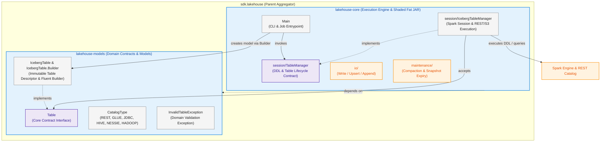
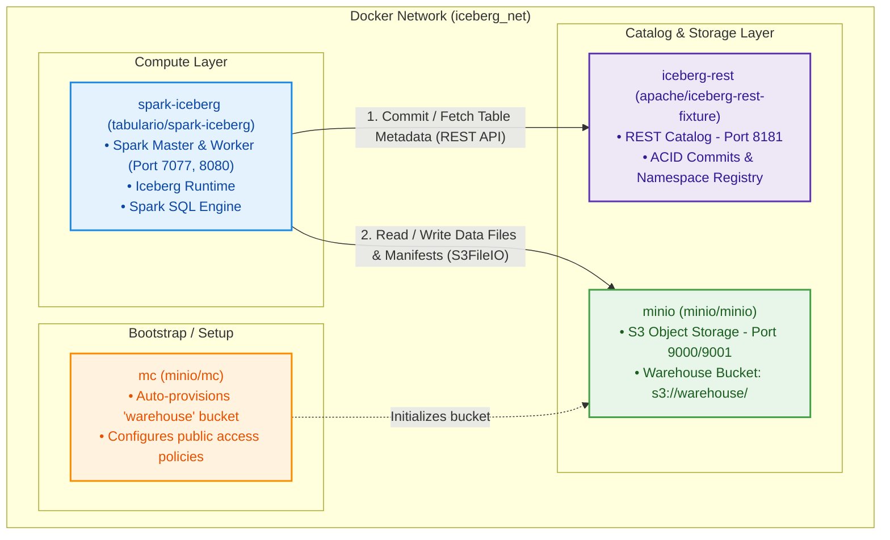

# Lakehouse SDK (`sdk.lakehouse`)

A modular Java SDK and execution framework for managing Apache Iceberg open-source table formats, schemas, and lifecycle operations across distributed compute engines (Apache Spark) and REST catalogs backed by S3/MinIO object storage.

| Conceptual Feature | Apache Iceberg | Delta Lake | Apache Hudi |
| :--- | :--- | :--- | :--- |
| **Point in Time** | Snapshot | Version | Commit / Instant |
| **Active Metadata Root** | `metadata.json` | `_delta_log/000...json` | `.hoodie/timeline` |
| **File Listing Manifest** | Manifest List + Manifests | Checkpoint Parquet files | Timeline metadata |
| **Compaction Command** | `rewrite_data_files` | `OPTIMIZE` | Compaction / Clustering |
| **Cleanup Command** | `expire_snapshots` + `remove_orphan_files` | `VACUUM` | Cleaner |
| **Row-Level Deletes** | Position & Equality Deletes | Deletion Vectors | Merge-on-Read (Delta Log) |
| **Default Catalog** | REST Catalog / Glue / Hive | Unity Catalog / Path-based | Hive Metastore / Glue |
| **Primary File Format** | Parquet (or ORC, Avro) | Parquet | Parquet (or HFile, ORC) |

---

## Architecture & Project Structure

The project is structured as a Maven multi-module architecture adhering to clean separation of concerns between declarative domain models and compute execution.



### Module Responsibilities

| Module | Purpose | Key Components |
| :--- | :--- | :--- |
| **`lakehouse-models`** | Pure, engine-agnostic domain contracts, metadata descriptors, and builders. | [`Table`](lakehouse-models/src/main/java/x/ruiz/playground/data/engineering/lakehouse/iceberg/Table.java), [`IcebergTable`](lakehouse-models/src/main/java/x/ruiz/playground/data/engineering/lakehouse/iceberg/IcebergTable.java) (`Builder`), [`CatalogType`](lakehouse-models/src/main/java/x/ruiz/playground/data/engineering/lakehouse/iceberg/CatalogType.java), [`InvalidTableException`](lakehouse-models/src/main/java/x/ruiz/playground/data/engineering/lakehouse/iceberg/InvalidTableException.java) |
| **`lakehouse-core`** | Compute execution, catalog connection management, Spark session initialization, and deployment packaging. | [`Main`](lakehouse-core/src/main/java/x/ruiz/playground/data/engineering/lakehouse/core/Main.java), [`TableManager`](lakehouse-core/src/main/java/x/ruiz/playground/data/engineering/lakehouse/core/session/TableManager.java), [`IcebergTableManager`](lakehouse-core/src/main/java/x/ruiz/playground/data/engineering/lakehouse/core/session/IcebergTableManager.java) |

---

## Infrastructure Topology

The local development environment runs via `docker-compose` combining Apache Spark, the Apache Iceberg REST Catalog fixture, and MinIO S3 storage.



---

## Quick Start & Setup

### 1. Start the Docker Environment
```bash
docker-compose up -d
```
This boots up:
- **Iceberg REST Catalog**: `http://localhost:8181`
- **MinIO S3 Storage**: `http://localhost:9000` (Console at `http://localhost:9001` with `admin`/`password`)
- **Spark Master UI**: `http://localhost:8080`

### 2. Build and Deploy the Application
Compile the multi-module project and submit the job using the [`Makefile`](Makefile):

```bash
make deploy
```

> [!TIP]
> The Makefile automatically packages `lakehouse-core` with the shaded `maven-shade-plugin`, copies the uber JAR to the container, and executes `spark-submit` against the Spark Master.

To deploy with custom parameters or master URL:
```bash
make deploy SPARK_MASTER=spark://spark-iceberg:7077
```

### 3. Interactive Spark SQL Shell
Launch a Spark SQL session directly against the Iceberg catalog:

```bash
make spark-sql
```

---

## Spark SQL Examples

### Inspect Namespaces and Tables
```sql
USE demo;
SHOW NAMESPACES;
SHOW TABLES IN default;
```

### Create a Partitioned Iceberg Table
```sql
CREATE TABLE IF NOT EXISTS demo.icebergingestion.taxis (
    vendor_id BIGINT,
    trip_id BIGINT,
    trip_distance FLOAT,
    fare_amount DOUBLE,
    store_and_fwd_flag STRING
)
USING iceberg
PARTITIONED BY (vendor_id);
```

### Insert and Query Records
```sql
INSERT INTO demo.icebergingestion.taxis
VALUES 
    (1, 1000371, 1.8, 15.32, 'N'),
    (2, 1000372, 2.5, 22.15, 'N'),
    (2, 1000373, 0.9, 9.01, 'N'),
    (1, 1000374, 8.4, 42.13, 'Y');

SELECT vendor_id, count(*), avg(fare_amount) 
FROM demo.icebergingestion.taxis 
GROUP BY vendor_id;
```