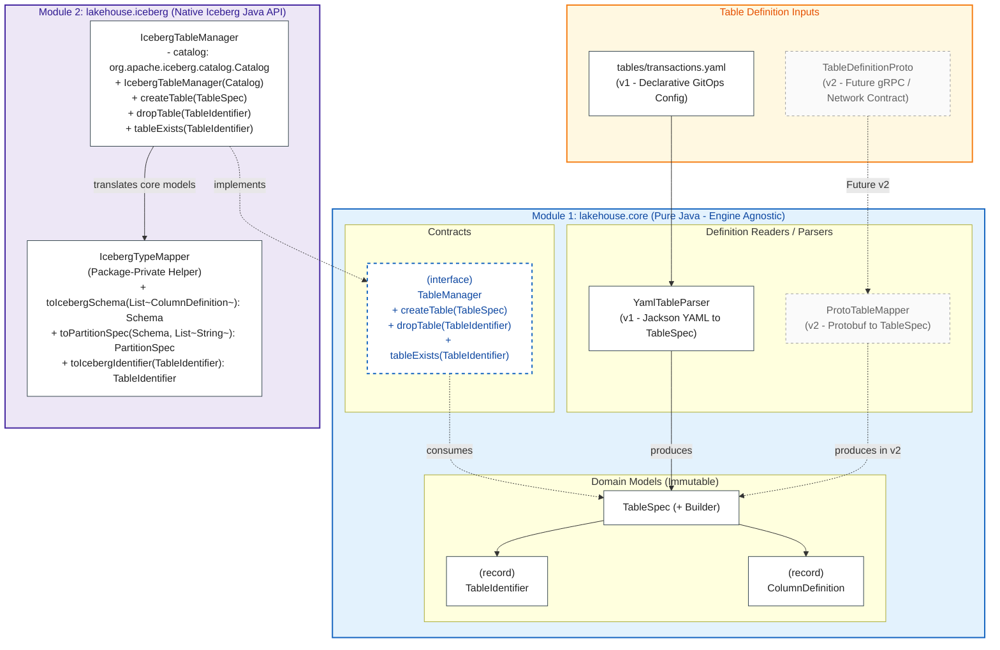

```mermaid
flowchart TB
    %% External Inputs
    subgraph Inputs["Table Definition Inputs"]
        YAMLFile["tables/transactions.yaml<br/>(v1 - Declarative GitOps Config)"]
        ProtoMsg["TableDefinitionProto<br/>(v2 - Future gRPC / Network Contract)"]
    end

    %% Module 1: Core
    subgraph Core["Module 1: lakehouse.core (Pure Java - Engine Agnostic)"]
        direction TB
        
        subgraph Parsers["Definition Readers / Parsers"]
            YAMLReader["YamlTableParser<br/>(v1 - Jackson YAML to TableSpec)"]
            ProtoMapper["ProtoTableMapper<br/>(v2 - Protobuf to TableSpec)"]
        end

        subgraph Models["Domain Models (Immutable)"]
            TID["(record)<br/>TableIdentifier"]
            COL["(record)<br/>ColumnDefinition"]
            TS["TableSpec (+ Builder)"]
        end

        subgraph Contracts["Contracts"]
            TM["(interface)<br/>TableManager<br/>+ createTable(TableSpec)<br/>+ dropTable(TableIdentifier)<br/>+ tableExists(TableIdentifier)"]
        end

        YAMLReader -->|produces| TS
        ProtoMapper -.->|produces in v2| TS
        TS --> TID
        TS --> COL
        TM -.->|consumes| TS
    end

    %% Module 2: Iceberg
    subgraph Iceberg["Module 2: lakehouse.iceberg (Native Iceberg Java API)"]
        direction TB
        
        ITM["IcebergTableManager<br/>- catalog: org.apache.iceberg.catalog.Catalog<br/>+ IcebergTableManager(Catalog)<br/>+ createTable(TableSpec)<br/>+ dropTable(TableIdentifier)<br/>+ tableExists(TableIdentifier)"]
        
        MAP["IcebergTypeMapper<br/>(Package-Private Helper)<br/>+ toIcebergSchema(List~ColumnDefinition~): Schema<br/>+ toPartitionSpec(Schema, List~String~): PartitionSpec<br/>+ toIcebergIdentifier(TableIdentifier): TableIdentifier"]

        ITM -->|translates core models| MAP
    end

    %% Connections across boundaries
    YAMLFile --> YAMLReader
    ProtoMsg -.->|Future v2| ProtoMapper
    ITM -.->|implements| TM

    %% Styling
    classDef inputBox fill:#FFF8E1,stroke:#F57F17,stroke-width:2px,color:#E65100;
    classDef coreBox fill:#E3F2FD,stroke:#1565C0,stroke-width:2px,color:#0D47A1;
    classDef icebergBox fill:#EDE7F6,stroke:#4527A0,stroke-width:2px,color:#311B92;
    classDef interfaceNode fill:#FFFFFF,stroke:#1565C0,stroke-width:2px,stroke-dasharray: 5 5,color:#0D47A1;
    classDef v2Node fill:#FAFAFA,stroke:#9E9E9E,stroke-width:1px,stroke-dasharray: 4 4,color:#616161;
    classDef classNode fill:#FFFFFF,stroke:#37474F,stroke-width:1px,color:#212121;

    class Inputs inputBox;
    class Core coreBox;
    class Iceberg icebergBox;
    class TM interfaceNode;
    class ProtoMsg,ProtoMapper v2Node;
    class YAMLFile,YAMLReader,TID,COL,TS,ITM,MAP classNode;
```