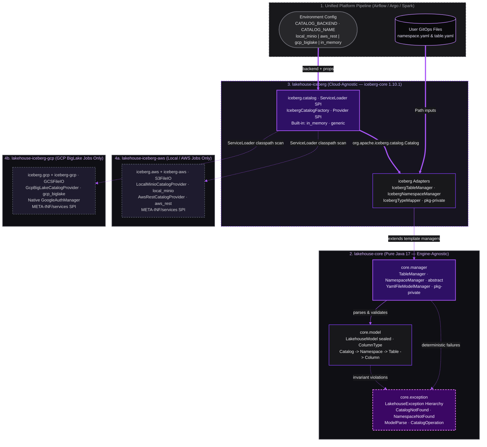

# Lakehouse SDK (`sdk.lakehouse`)

A multi-module **Java 17** SDK for declarative GitOps management of lakehouse namespaces and tables across Apache Iceberg catalogs. Designed for platform pipelines (Airflow, Argo, Spark, CI/CD) so a **single unified pipeline codebase** can deploy identical YAML definitions to local Docker REST + MinIO, AWS Iceberg REST, or Google Cloud BigLake Iceberg REST simply by swapping environment configuration and dropping in the target cloud SPI plugin JAR.

---

## Core Design Principles

- **Acyclic, Self-Validating Domain Models (`lakehouse-core`):** Composable immutable Java 17 `record`s (`CatalogModel` ← `NamespaceModel` ← `TableModel` → `ColumnModel`) with a closed canonical `ColumnType` enum and zero engine or serialization dependencies.
- **Encapsulated Template-Method Managers:** `TableManager` and `NamespaceManager` are `abstract` base classes whose `public final` `Path`-based methods own YAML parsing and validation via package-private `FileModelManager` / `YamlFileModelManager`—preventing calling libraries from bypassing validation or touching parsers directly.
- **Platform-Provisioned Catalogs & Strict Parent Checks:** Catalogs are provisioned externally by platform infrastructure (never via YAML). Managers enforce exact `catalog.name()` identity (`CatalogNotFoundException` on cross-environment mismatch) and never silently auto-create missing catalogs or namespaces (`NamespaceNotFoundException`).
- **Cloud-Isolated `ServiceLoader` SPI Plugins:** `lakehouse-iceberg` has zero AWS or GCP dependencies. Cloud-specific `FileIO` bundles and catalog providers live in thin sibling JARs (`lakehouse-iceberg-aws`, `lakehouse-iceberg-gcp`) discovered at runtime via `java.util.ServiceLoader`, keeping Spark/pipeline shaded fat JARs lean and conflict-free.

---

## Architecture Overview

### Multi-Module & SPI Plugin Architecture


```mermaid
%%{init: {"theme": "base", "themeCSS": "svg { background-color: #09090B !important; border-radius: 8px; }", "themeVariables": {"darkMode": true, "background": "#09090B", "mainBkg": "#18181B", "textColor": "#F4F4F5", "primaryColor": "#18181B", "primaryTextColor": "#F4F4F5", "primaryBorderColor": "#7C3AED", "lineColor": "#A855F7", "secondaryColor": "#16141F", "tertiaryColor": "#0F0F14", "edgeLabelBackground": "#18181B", "clusterBkg": "#0F0F14", "clusterBorder": "#52525B", "titleColor": "#D8B4FE", "fontFamily": "Inter, ui-sans-serif, system-ui, -apple-system, sans-serif", "fontSize": "13px"}, "flowchart": {"curve": "basis", "nodeSpacing": 42, "rankSpacing": 56, "padding": 14}}}%%
flowchart TB
    subgraph Pipeline["1. Unified Platform Pipeline (Airflow / Argo / Spark)"]
        ENV(["Environment Config\nCATALOG_BACKEND · CATALOG_NAME\nlocal_minio | aws_rest | gcp_biglake | in_memory"])
        YAML[("User GitOps Files\nnamespace.yaml & table.yaml")]
    end

    subgraph Core["2. lakehouse-core (Pure Java 17 — Engine-Agnostic)"]
        MOD["core.model\nLakehouseModel sealed · ColumnType\nCatalog -> Namespace -> Table -> Column"]
        MGR["core.manager\nTableManager · NamespaceManager · abstract\nYamlFileModelManager · pkg-private"]
        EXC["core.exception\nLakehouseException Hierarchy\nCatalogNotFound · NamespaceNotFound\nModelParse · CatalogOperation"]
    end

    subgraph Iceberg["3. lakehouse-iceberg (Cloud-Agnostic — iceberg-core 1.10.1)"]
        FAC["iceberg.catalog · ServiceLoader SPI\nIcebergCatalogFactory · Provider SPI\nBuilt-in: in_memory · generic"]
        ITM["iceberg Adapters\nIcebergTableManager · IcebergNamespaceManager\nIcebergTypeMapper · pkg-private"]
    end

    subgraph AwsPlugin["4a. lakehouse-iceberg-aws (Local / AWS Jobs Only)"]
        AWS["iceberg.aws + iceberg-aws · S3FileIO\nLocalMinioCatalogProvider · local_minio\nAwsRestCatalogProvider · aws_rest\nMETA-INF/services SPI"]
    end

    subgraph GcpPlugin["4b. lakehouse-iceberg-gcp (GCP BigLake Jobs Only)"]
        GCP["iceberg.gcp + iceberg-gcp · GCSFileIO\nGcpBigLakeCatalogProvider · gcp_biglake\nNative GoogleAuthManager\nMETA-INF/services SPI"]
    end

    ENV ==>|"backend + props"| FAC
    YAML ==>|"Path inputs"| ITM

    FAC -.->|"ServiceLoader classpath scan"| AWS
    FAC -.->|"ServiceLoader classpath scan"| GCP
    FAC ==>|"org.apache.iceberg.catalog.Catalog"| ITM

    ITM -->|"extends template managers"| MGR
    MGR -->|"parses & validates"| MOD
    MGR -.->|"deterministic failures"| EXC
    MOD -.->|"invariant violations"| EXC

    classDef core fill:#2E1065,stroke:#A855F7,stroke-width:2px,color:#F5F3FF
    classDef service fill:#18181B,stroke:#7C3AED,stroke-width:1.5px,color:#F4F4F5
    classDef store fill:#09090B,stroke:#C084FC,stroke-width:1.5px,color:#EDE9FE
    classDef external fill:#27272A,stroke:#71717A,stroke-width:1.5px,color:#E4E4E7
    classDef async fill:#1E1B2E,stroke:#6B7280,stroke-width:1.25px,stroke-dasharray:4 3,color:#D4D4D8
    classDef guard fill:#3B0764,stroke:#E879F9,stroke-width:2px,stroke-dasharray:5 3,color:#FAF5FF

    class ENV external
    class YAML store
    class FAC,MGR core
    class ITM,MOD service
    class EXC guard
    class AWS,GCP async

    style Pipeline fill:#18181B,stroke:#52525B,stroke-width:1.25px,stroke-dasharray:5 4,color:#A1A1AA
    style Core fill:#0F0F14,stroke:#52525B,stroke-width:1.5px,color:#D8B4FE
    style Iceberg fill:#16141F,stroke:#6D28D9,stroke-width:1.25px,stroke-dasharray:4 3,color:#C4B5FD
    style AwsPlugin fill:#0F0F14,stroke:#52525B,stroke-width:1.5px,color:#D8B4FE
    style GcpPlugin fill:#0F0F14,stroke:#52525B,stroke-width:1.5px,color:#D8B4FE
```

### Runtime Execution Flow (Template Method + SPI)

```mermaid
%%{init: {"theme": "base", "themeCSS": "svg { background-color: #09090B !important; border-radius: 8px; }", "themeVariables": {"darkMode": true, "background": "#09090B", "mainBkg": "#18181B", "textColor": "#F4F4F5", "primaryColor": "#18181B", "primaryTextColor": "#F4F4F5", "primaryBorderColor": "#7C3AED", "lineColor": "#A855F7", "actorBkg": "#18181B", "actorBorder": "#7C3AED", "actorTextColor": "#F4F4F5", "actorLineColor": "#52525B", "signalColor": "#A855F7", "signalTextColor": "#E4E4E7", "labelBoxBkgColor": "#2E1065", "labelBoxBorderColor": "#A855F7", "labelTextColor": "#F5F3FF", "loopTextColor": "#D8B4FE", "noteBkgColor": "#1E1B2E", "noteBorderColor": "#6D28D9", "noteTextColor": "#EDE9FE", "activationBkgColor": "#4C1D95", "activationBorderColor": "#C084FC", "sequenceNumberColor": "#FAF5FF", "fontFamily": "Inter, ui-sans-serif, system-ui, -apple-system, sans-serif", "fontSize": "13px"}}}%%
sequenceDiagram
    autonumber
    participant Pipe as Pipeline (Airflow / Argo)
    participant Fac as IcebergCatalogFactory
    participant SL as Java ServiceLoader
    participant Prov as Cloud CatalogProvider (AWS / MinIO / GCP)
    participant Mgr as IcebergTableManager (extends TableManager)
    participant Cat as Iceberg RESTCatalog

    Pipe->>+Fac: loadCatalog(backend, CatalogModel("data_lake"), envProps)
    Fac->>SL: ServiceLoader.load(IcebergCatalogProvider.class)
    SL-->>Fac: Providers discovered from deployed plugin JARs
    Fac->>+Prov: loadCatalog(CatalogModel("data_lake"), envProps)
    Prov->>Prov: Validate required keys & apply cloud defaults (FileIO / Auth)
    Prov->>Cat: CatalogUtil.buildIcebergCatalog("data_lake", resolvedProps, null)
    deactivate Prov
    deactivate Fac
    Cat-->>Pipe: Initialized Catalog

    Pipe->>Mgr: new IcebergTableManager(catalog)
    Pipe->>+Mgr: createTable(Path.of("table.yaml"))
    Note over Mgr: TableManager.createTable (final) parses & validates YAML via package-private YamlFileModelManager
    Mgr->>Mgr: Verify catalog.name().equals(model.catalog().name())
    Mgr->>Cat: Check namespaceExists -> tableExists -> createTable(Schema, PartitionSpec)
    Cat-->>-Pipe: Idempotent success (or CatalogNotFound / NamespaceNotFound)
```

---

## Module Layout

| Module | Artifact ID | Dependencies | Responsibilities |
| :--- | :--- | :--- | :--- |
| **Root Reactor** | `sdk.lakehouse` (`pom`) | Centralizes `<iceberg.version>` (`1.10.1`), Jackson, JUnit 5, AssertJ | Multi-module build & dependency management |
| **Core Contracts** | `lakehouse-core` | Jackson YAML, Log4j2 *(zero Iceberg/Spark/cloud deps)* | Immutable models (`core.model`), Template-Method managers + package-private YAML file manager (`core.manager`), exception hierarchy (`core.exception`) |
| **Iceberg Adapter** | `lakehouse-iceberg` | `lakehouse-core`, `iceberg-core` *(zero AWS/GCP deps)* | `IcebergTableManager`, `IcebergNamespaceManager`, package-private `IcebergTypeMapper`, `IcebergCatalogProvider` SPI, `IcebergCatalogFactory`, built-in `in_memory` & `generic` providers |
| **AWS / MinIO Plugin** | `lakehouse-iceberg-aws` | `lakehouse-iceberg`, `iceberg-aws`, `iceberg-aws-bundle` | `LocalMinioCatalogProvider` (`local_minio`), `AwsRestCatalogProvider` (`aws_rest`), opt-in Docker REST + MinIO IT |
| **GCP BigLake Plugin** | `lakehouse-iceberg-gcp` | `lakehouse-iceberg`, `iceberg-gcp`, `iceberg-gcp-bundle` | `GcpBigLakeCatalogProvider` (`gcp_biglake` with `GCSFileIO` + native `GoogleAuthManager`), opt-in BigLake REST IT |

---

## Declarative YAML Formats

**Namespace YAML (`namespace.yaml`):**
```yaml
catalog: data_lake
namespace: market_data
```

**Table YAML (`table.yaml`):**
```yaml
catalog: data_lake
namespace: market_data
tableName: transactions
columns:
  - name: date
    type: DATE
    nullable: false
  - name: id
    type: BIGINT
    nullable: false
  - name: amount
    type: DECIMAL
    nullable: true
partitionColumn: date
```

*Supported canonical types:* `STRING`, `INT`, `BIGINT`, `DOUBLE`, `BOOLEAN`, `DATE`, `TIMESTAMP` (Iceberg `timestamptz`), `DECIMAL` (Iceberg `DECIMAL(38, 9)`). Omitted `nullable` defaults to `true`; omitted `partitionColumn` creates an unpartitioned table.

---

## Build, Test & Local Sandbox

### 1. Run All Unit Tests & Strict Javadoc Validation (No Docker / Cloud Creds Needed)
```bash
mvn clean test
mvn test javadoc:javadoc -Ddoclint=all
```

### 2. Run Opt-In Local Docker REST + MinIO Integration Test
Start the local sandbox (`iceberg-rest` on `:8181`, MinIO on `:9000` / `:9001`, Spark Iceberg):
```bash
docker compose up -d
mvn test -pl lakehouse-iceberg-aws -am \
  -Dtest=IcebergRestCatalogIT \
  -Dsurefire.failIfNoSpecifiedTests=false
```

Inspect created namespaces and tables via Spark SQL:
```bash
docker exec -it spark-iceberg spark-sql
```
```sql
SHOW NAMESPACES;
SHOW TABLES IN demo.market_data;
DESCRIBE TABLE EXTENDED demo.market_data.transactions;
```

### 3. Run Opt-In Live GCP BigLake REST Integration Test
Requires active Google Application Default Credentials (`gcloud auth application-default login` or workload identity):
```bash
mvn test -pl lakehouse-iceberg-gcp -am \
  -Dtest=BigLakeRestCatalogIT \
  -Dsurefire.failIfNoSpecifiedTests=false \
  -Dbiglake.warehouse=gs://your-bucket/ \
  -Dbiglake.project=your-gcp-project-id
```

---

## Specifications (Spec-Driven Development)

- [specs/00_project_structure_and_organization.md](specs/00_project_structure_and_organization.md) — Multi-module layout, package roles, visibility, and naming governance.
- [specs/01_lakehouse_core_contracts.md](specs/01_lakehouse_core_contracts.md) — Core domain models, Template-Method managers, package-private YAML file manager, and exception hierarchy.
- [specs/02_iceberg_catalog_adapter.md](specs/02_iceberg_catalog_adapter.md) — Cloud-agnostic Iceberg adapter, `ServiceLoader` catalog SPI, and `lakehouse-iceberg-aws` plugin.
- [specs/03_iceberg_gcp_biglake_plugin.md](specs/03_iceberg_gcp_biglake_plugin.md) — `lakehouse-iceberg-gcp` BigLake REST plugin (`GCSFileIO` + `GoogleAuthManager`) and Iceberg `1.10.1` upgrade.
