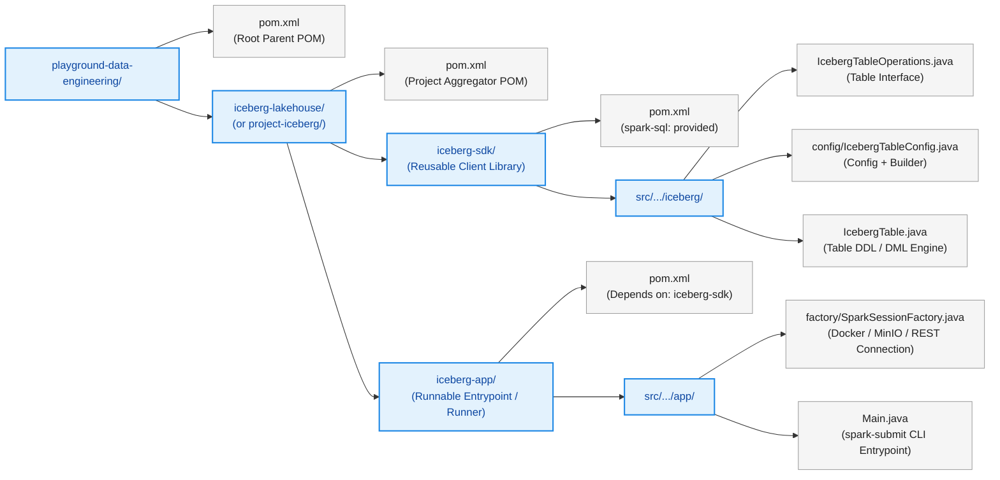
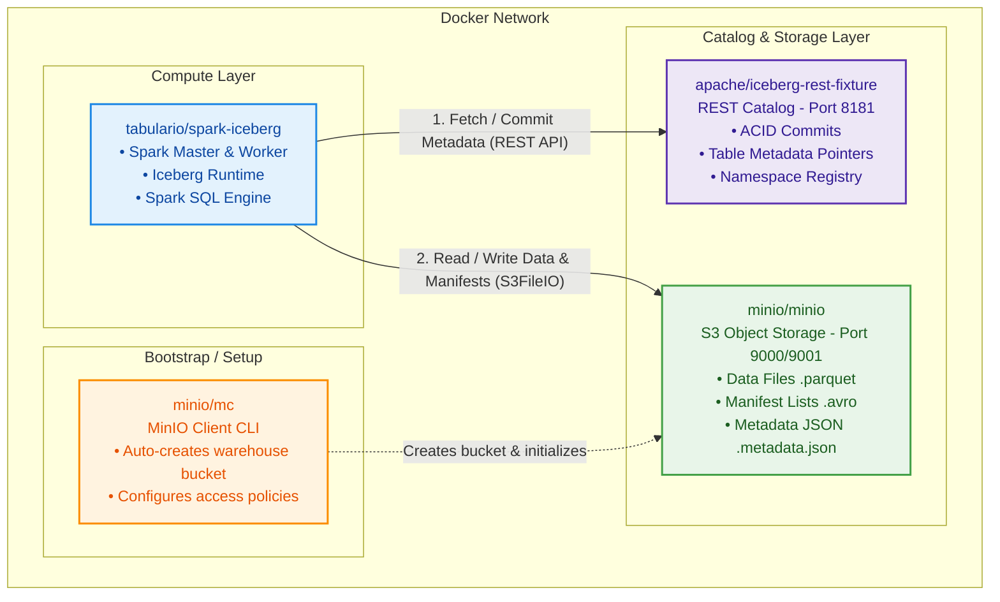

# Proposed Project Structure

# Set Up
https://iceberg.apache.org/spark-quickstart/

`docker-compose up` -> sets up spark, iceberg rest catalog, and minio (storage) \
`docker exec -it spark-iceberg spark-sql`

This sets up a Iceberg REST catalog in spark called demo.

The docker-compose creates the below setup:


## Creating a database
`CREATE DATABASE IF NOT EXISTS demo.icebergingestion;`

## Creating a table
```sparksql
CREATE TABLE demo.icebergingestion.taxis
(
  vendor_id bigint,
  trip_id bigint,
  trip_distance float,
  fare_amount double,
  store_and_fwd_flag string
)
PARTITIONED BY (vendor_id);
```

## Writing data
```sparksql
INSERT INTO demo.icebergingestion.taxis
VALUES (1, 1000371, 1.8, 15.32, 'N'), (2, 1000372, 2.5, 22.15, 'N'), (2, 1000373, 0.9, 9.01, 'N'), (1, 1000374, 8.4, 42.13, 'Y');
```